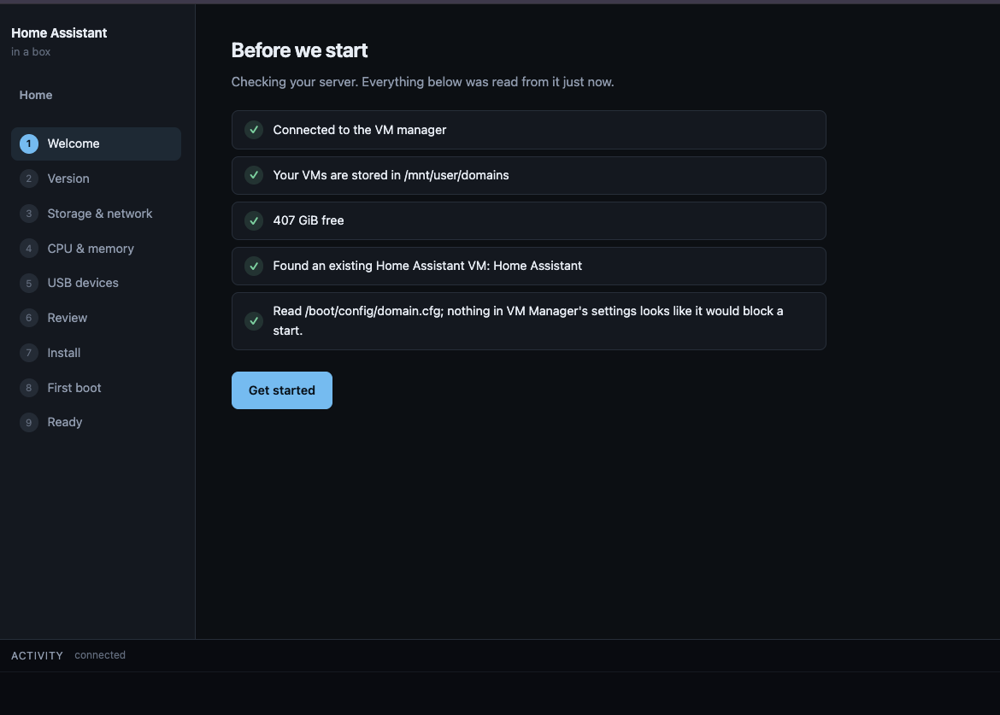

# Home Assistant inabox v3

Home Assistant inabox installs a full Home Assistant OS virtual machine on your Unraid server and looks after it for you. You click install, answer a few questions in a web page and a few minutes later you're creating your Home Assistant account. No ISOs to download, no VM settings to work out, no XML to touch.

This is version 3 and it's a complete rewrite of the old container. If you're coming from v2 there's a section further down about what's changed and how to move over. The short version is that your Home Assistant VM is untouched either way.

## What you end up with

A Home Assistant OS VM, built the same way Unraid itself would build it, running on your server with its own IP address on your network. The container's web page becomes a little home screen for it afterwards, where you can open Home Assistant, start the VM if it's stopped and choose whether the container should keep it running for you.

I built the original version of this because installing Home Assistant as a VM on Unraid was a pain. You had to find the right image, uncompress it, make a VM with the right machine type etc etc. This container does all of that for you and v3 now shows you what it's doing while it does it.

## Installing

1. Go to the Apps tab (CA) on your Unraid server
2. Search for Home Assistant inabox v3 and click install
3. Leave the settings as they are unless you have a reason not to and hit apply
4. Click the container's WebUI button to open the wizard

The wizard walks you through the rest. It checks your server first, tells you what it found and won't let you start an install that can't work, like when the VM service is turned off.

A couple of things worth knowing as you go through it. The storage and network step shows you the MAC address the VM will get and my advice is to give that MAC a fixed IP in your router's DHCP settings before you finish installing. Do it in the router rather than setting a static IP inside Home Assistant itself. A static IP configured inside Home Assistant is applied by the very thing you'd need network access to fix. So if you made a mistake and the subnet was wrong on this headless VM the only way in is the VM console. A router side reservation doesn't have any of that risk.

The USB step is optional. If you've got a Zigbee or Z-Wave stick plugged into your server, tick it and it gets passed into the VM, ready for Home Assistant to discover during onboarding. More on how that works below.

Once the install starts you'll see the progress. The image download with percentages, a checksum verification against the official release, the VM being defined and started and then the first boot milestones as they genuinely happen. First boot can take several minutes on a busy array and the page says so rather than showing you a spinner and hoping.

At the end there's a big button to open Home Assistant in a new tab and underneath it the page mirrors your onboarding progress live as you create your account and set your location. That mirror is read only. Your setup happens entirely in Home Assistant's own page and this container just watches so it knows when you're done.

## The home page

After an install, or whenever the container finds Home Assistant VMs already on your server, its web page becomes a status panel rather than the wizard. Each VM it's sure about gets a row with its state, its address, a button to open it and a checkbox called keep this VM running.

Tick that checkbox and the container watches the VM. If it's found stopped, it gets started again and you get a notification through whatever channels you've set up in Unraid's own notification settings. The container doesn't invent its own notification system, it uses yours. If a VM refuses to stay up the watcher notices it's flapping, stops trying and tells you why instead of restarting it in a loop forever.

The watch settings survive container restarts and image updates, so you set them once.

One thing I'd point out here. The container only ever starts VMs, it never stops them. There's no stop button on the panel and the watcher will never shut anything down. Stopping your VM is your business and Unraid's VM manager does it fine.

## Already running Home Assistant?

The container looks at every VM on your server and works out which ones are Home Assistant. It does this by reading the VM's disk and checking for Home Assistant OS's own partition layout, so it recognises your existing install even when the VM is switched off. Anything it can't be sure about it simply leaves alone and it never guesses.

Your existing VM shows up on the home page with the same open button and keep running checkbox as one this container installed. Nothing is changed on it unless you tick that box and even then the only writes are starting it when stopped and pointing Unraid's own WebUI link at the right address.

## USB devices

This is the part I think beginners will appreciate most. The USB step doesn't just list devices, it tells you what they are when it honestly can.

It ships Home Assistant's own USB discovery data, the same data Home Assistant uses to recognise sticks itself. So a ConBee II shows up labelled as a Zigbee coordinator, a Z-Stick as a Z-Wave controller and so on. Bluetooth adapters are recognised by their USB class, which works for adapters that didn't exist when this container was built. A few well known devices get a word of advice too. If it sees a UPS it'll mention that Unraid usually monitors that itself and passing it through takes it away from your server's shutdown protection. If it sees a Google Coral it'll mention those are usually better left on Unraid for a Frigate container.

When it doesn't know what something is, it says nothing rather than guessing. A confidently wrong label is worse than no label. Devices it can't identify are still listed and still selectable, just without a claim attached.

2 things are never offered at all. USB hubs and your Unraid boot flash. Passing the boot flash into a VM would take your server down, so the container uses the same detection Unraid itself uses and keeps it off the list entirely, wherever it's plugged in.

If you pass a stick through and later unplug it, the VM still boots. The passthrough is written as optional so a missing device is skipped rather than being a boot failure.

For Zigbee sticks specifically, plug them into a USB 2.0 port or use a short extension cable if you can. USB 3.0 ports put out interference right in the 2.4 GHz band Zigbee uses and it's a well known cause of flaky Zigbee networks. The wizard reminds you of this when it sees a Zigbee coordinator.

## Coming from v2

Unraid doesn't update Docker templates when a container updates, so v3 ships with a guard rather than a surprise.

If you update the old container and it starts with the v2 template, nothing breaks. Your VM keeps running exactly as it was. The container starts in a notice mode instead of half working and clicking your old WebUI button shows you a page explaining what's happened and what to do. The same explanation is in the container's logs.

Moving over is quick.

1. Install Home Assistant inabox v3 from the Apps tab
2. Open it and check your VM shows up on the home page
3. Delete the old HomeAssistant_inabox container

Deleting the old container does not touch your VM. The VM lives in your domains share and belongs to Unraid's VM manager, not to any container. Once you're moved over, the old appdata folder at appdata/HomeAssistant_inabox isn't used by anything and you can delete it whenever you like.

If you'd rather stay on v2 for now, change the repository field in your existing template to spaceinvaderone/ha_inabox:2 and restart the container. That tag is frozen at the last v2 release and will keep working as it always did.

## The nerdy bit

You don't need any of this to use the container, but if you like knowing how things work, here's what actually happens during an install.

The container fetches the latest Home Assistant OS release from the official GitHub releases, verifies the download against the published SHA256 checksum, uncompresses it and resizes the disk image to whatever size you chose. It builds the VM the way Unraid builds VMs, including copying the OVMF firmware variables file properly rather than creating an empty one and it reads your server's QEMU to pick the newest machine type available. Then it defines the VM through libvirt and starts it.

During first boot it watches for 4 milestones. The VM running, the guest agent answering, an IP address appearing and Home Assistant's own API responding. Recent Home Assistant releases move their web interface from port 8123 to port 80 the moment onboarding finishes and the container follows that move automatically, so the open button and Unraid's WebUI link keep working when other setups would be pointing at a dead port.

The WebUI link written into the VM is the VM's IP address rather than homeassistant.local. The mDNS name is fine right up until you have 2 Home Assistant VMs on one network, at which point it can only point at one of them. The IP is always right and the container corrects it automatically if DHCP ever moves it.

## Requirements

You need the VM service enabled on your server, under Settings then VM Manager. The wizard checks this and tells you if it's off. Hardware virtualisation needs to be on in your BIOS, which it almost certainly already is if you've ever run a VM.

v3 was built and tested on Unraid 7.x. The container runs unprivileged and most of its host mounts are read only.

